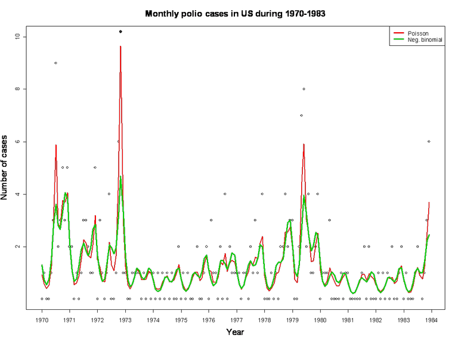

#  Negative binomial serially correlated counts

Filed under:  [Count data][1], [Generalized Linear Mixed Models][2], [State Space Model][11]

Compares a negative binomial response to Poisson responses for the polio data.

## Model description
For a background on the model and the polio data please see:  [A discrete valued time series model; Polio data][12]

We replace the Poisson response with a negative binomial response that allows overdispersion. The negative binomial model has one extra parameter, the overdispersion tau = variance / mean.

The Poisson and negative binomial models are supplied in two versions: normal and separable. Read about the latter in the ADMB-RE manual, but in short this version of the code runs faster, but is slightly harder to read. The files are:

## Files
* [polio.dat][3] - Data file
* [polio2.tpl][4]  - negative binomial (normal)
* [polio2s.tpl][5] - negative binomial (separable)
* [polio3.tpl][6] - Poisson (normal)
* [polio3s.tpl][7] - Poisson (separable)
* [Negative binomial serially correlated counts ][8]
* [polio_plot.png][10]
* 

## Running the models
You have to copy any of the tpl-files into polio.tpl (to have the executable read [polio.dat][3]) before you compile.

 

## Results
The estimate of overdispersion parameter is tau = 4.9 under the negative binomial, and by construction tau = 1 under the Poisson model. Hence, the latent process that governs the mean has to account for overdispersion as well as serial correlation under the Poisson model. This can be seen in the figure above that the Poisson mean "stretches" more after the observations. Further: the variance of the latent process is lower under the neg. bin. model, and the serial correlation is higher.

 

[1]: ./../
[2]: ./../../
[3]: ./polio.dat
[4]: ./polio2.tpl
[5]: ./polio2s.tpl
[6]: ./polio3.tpl
[7]: ./polio3s.tpl
[10]: ./polio.png
[11]: ./../../../state-space-models/
[12]: ./../a-discrete-valued-time-series-model/
