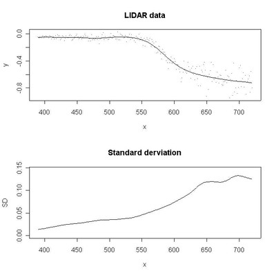

#  Mean and variance

Filed under: [Generalized Linear Mixed Models][5], [GAMs as Mixed Models][6]

Both mean and variance vary smoothly as a function of a covariate. Example of model with two smoothing splines, each with their own smoothing parameter

An assumption underlying ordinary regression is that all observations have the same variance. This assumption does not always hold, as for the data shown in the figure below (upper panel). It is clear that the variance increases to the right. It is also clear that the mean of _y_ is not a linear function of _x_. Penalized splines can be used to model the mean and variance of _y_ non-parametrically. In order to ensure that the variance is positive, we model the log-variance by a spline function, rather than the variance itself. A more detailed discussion of the model and the estimation approach can be found here: 

 

The LIDAR data shown in the figure below are taken from the book Ruppert et al. (2003). The file [lidar.s][1] shows how to create design matrices for B-splines in R (S-Plus). When sourced into R, the file creates the input file for ADMB [lidar.dat][2]. You can use [lidar.s][1] as a basis for you own spline models.

 

### Prediction interval

It could be interesting to look at a prediction interval for a new observation. The uncertainty in that interval would have to depend on the uncertainty of both splines.  
 

### Files

* [lidar.s][1]
* [lidar.dat][2]
* [lidar.pin][3]
* [lidar.tpl][4]

### **References**

Ruppert, D., Wand, M. & Carroll, R. (2003), _Semiparametric Regression_, Cambridge University Press.

[1]: ./lidar.s
[2]: ./lidar.dat
[3]: ./lidar.pin
[4]: ./lidar.tpl
[5]: ./../../
[6]: ./../
