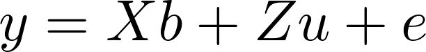

#  BCB bowheads

Filed under:  [Abundance estimation][1], [REML][2], [Generalized Linear Mixed Models][6]

Zeh & Punt (2005) combined data from two different counting methodologies in order to estimate the rate of increase of BCB bowhead whales. On a log-scale they fitted a linear mixed-effects models using REML estimates for the variance parameters. This example shows how random effects in ADMB can be used to obtain REML estimates.

 

Restricted maximum likelihood estimation (REML) is often used to estimate variance parameters in the linear mixed-model:

where _X_ and _Z_ are covariate matrices, _b_ are the fixed-effects, _u_ are the random effects and _e_ are the error terms. One way of defining the REML procedure is to:

* Assign a flat prior to _b._
* Integrate the likelihood with respect to both _b_ and _u_.
The resulting REML likelihood is then maximized with respect to the variance parameters (variances of _u_ and _e_).

 

To implement this in ADMB-RE we declare both _b_ and _u_ as random effects vectors. As a result, the likelihood is integrated with respect to both parameters. But, while there is a contribution to the objective function comming from the random effects distribution of _u_, there should be no such contribution from _b _(i.e. a flat prior).

 

Using this procedure you do not have to derive the "REML correction" to the log-likelihood function by hand. It is done automatically for you by ADMB-RE.

### Files
* [bcb.dat][3]
* [bcb.tpl][4]
* [bcb.pin][5]

### References

Zeh, J.E., and A.E. Punt. "Updated 1978-2001 Abundance Estimates and Their Correlations for  the Bering-Chukchi-Beaufort Seas Stock of Bowhead Whales." Journal of Cetacean 

Research and Management 7, no. 2 (2005): 169-75. 

[1]: https://github.com/admb-project/examples/search?utf8=%E2%9C%93&q=Abundance+estimation
[2]: https://github.com/admb-project/examples/search?utf8=%E2%9C%93&q=REML
[3]: ./bcb.dat
[4]: ./bcb.tpl
[5]: ./bcb.pin
[6]: ./../
