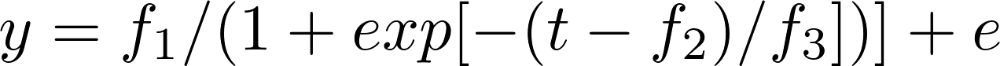

#  Orange trees

Filed under:  [Growth models][1]

Simple growth curve example with individual effects (random effects) from Pinheiro & Bates (2000)

A growth curve model fitted to the "orange tree" data by *Pinheiro & Bates (2000, Ch.8.2)* as an illustration of the [R][3] (S-Plus) routine nlme(). The logistic growth curve is given as

 

where _y_ is the response and _t_ is the age of the tree. The regression parameters to be estimated are: f1, f2 and f3, and e is the residual error term. A random effect _u_ is added to the parameter f1.

### Details
* [orange.pdf][4]

### Extension of the model
* [Extension: Crossed RE's][5]
* [Extension: Correlated RE's][6]

### Files
* [orange.tpl][7]
* [orange.dat][8]
* [orange.pin][9]
* [orange.par][10]

[1]: ./../
[3]: http://www.r-project.org/
[4]: ./orange.pdf
[5]: ./extension-crossed-res/
[6]: ./extension-correlated-res/
[7]: ./orange.tpl
[8]: ./orange.dat
[9]: ./orange.pin
[10]: ./orange.par
