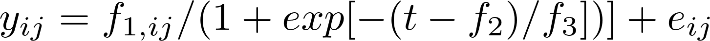
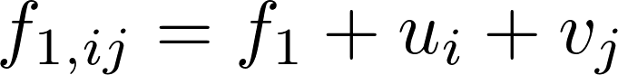

#  Extension: crossed RE's

Filed under: [Growth Models][1]

Adds a "day effect" following Millar (2004, Aust NZ J. Stat, 46, p. 543-554)

The following example was considered by Millar (2004, Aust NZ J. Stat, 46, p. 543-554). A "day effect" (_v_) was added to the original model formulation, yielding

    

where _u_ is a tree-effect and _v_ is a day-effect. This is an example of a model where the random effects _u_ and _v_ are crossed. Millar (2004) used simulated likelihood to evaluate the marginal likelihood. 

###Files:
* [orange2.dat][2]
* [orange2.par][3]
* [orange2.pin][4]
* [orange2.tpl][5]

[1]: ./../../
[2]: ./orange2.dat
[3]: ./orange2.par
[4]: ./orange2.pin
[5]: ./orange2.tpl
