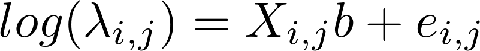
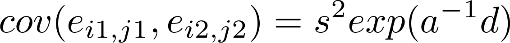

#  Poisson GLMM

Filed under: [Spatial Models][19]

GLMM with spatial correlation, where the locations do not lie on a grid. Illustrates how you can parameterize a large correlation matrix in terms of an isotropic correlation function r(d), where "d" is the distiance between two locations.

### **Model description**

Our data are 100 Poisson counts (y), each with parameter lambda. The datapoints are index by i and j (_i,j_=1,...,10). It is assumed that 

where  _Xi,jb_ is a linear predictor and ei,j are Gaussian random variables with covariance

Here _d_ is the Euclidean distance between the two positions.

### Orthogonalization

This example shows a mathematical trick that is useful in all sorts of regression analysis: make the columns of the design matrix X orthogonal. This makes the model more stable, but when you later shall interpret the output (b vector) you must "transform back".

>DATA_SECTION

>>matrix dd(1,n,1,n);		// Distance matrix

>LOC_CALCS

>>int i, j;

>>dmatrix tX=trans(X);

>>ncol1=norm(tX(1));

>>tX(1)/=ncol1; 

>>tX(2)-= tX(1)*tX(2)*tX(1);

>>cout << tX(1)*tX(2) << endl;

>>ncol2=norm(tX(2));

>>tX(2)/=ncol2; 

>>X=trans(tX);

>END_CALCS
     
     
###Files:
* [spatial.dat][1]
* [spatial.tpl][2]
* [spatial.par][3]
* [spatial.pin][4]

[1]: ./spatial.dat
[2]: ./spatial.tpl
[3]: ./spatial.par
[4]: ./spatial.pin
[19]: ./../
