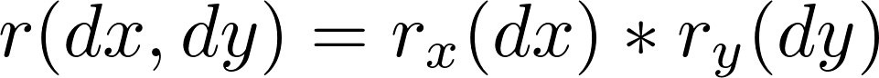
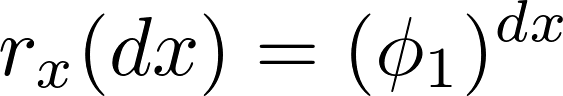
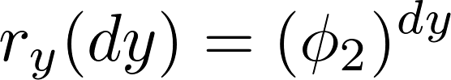
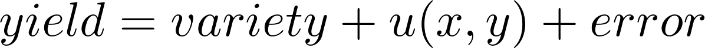

#  Comparison of spatial approaches in ADMB

Three different implementations of the same model with separable spatial covariance function in a fully Gaussian situation: i) Plain ADMB (non-random effect) ii) Geostatistical formulation iii) Hybrid approach. The example helps the user understand the different spatial approaches available in ADMB.

The separable covariance function requires that observations are made on a two-dimensional spatial grid (x- and y-directions). The separable assumption is: for locations separated by distances  _dx_  and  _dy_ the correlation is on a product form:

  

You need to work through the example _Separable: Method explanation_ to fully understand separability and its relation to Kronecker products.

 

The example we shall use is in an agricultural setting where the response variable "yield" is allowed to vary spatially and with "variety" as an explanatory variable. A simple Gaussian model is assumed (in R-notation for the linear predictor)

where  _u(x,y)_  is the spatially varying random field. Both  _u(x,y)_  and _error_  are taken to be Gaussian, so the full model is Gaussian. Hence it is possible to write down the full covariance matrix of the vector  _yield_. This is what is done in  "ar1ar1_dense.tpl"  which do not require random effects at all. In "ar1ar1_prior.tpl" the same is implemented using random effects and the Gaussian prior feature (in this particular example random effects does not really make the world easier). The main part of both programs is to set up the joint correlation matrix.

 

The formulation "ar1ar1_sparse.tpl" exploits sparseness of the precission matrix and looks very different from the other two programs. (This harder to understand and you must read!). It gives identical results, and runs much faster in larger examples when run with the "-shess" command line option.

### Running the programs
    ar1ar1_dense -ind ar1ar1.dat
    ar1ar1_prior -ind ar1ar1.dat
    ar1ar1_sparse -shess -ind ar1ar1.dat

### A note on missing values

There need not be observations at every grid point, but the latent GMRF needs nevertheless to be represented in

###Files
* [ar1ar1.dat][1]
* [ar1ar1_dense.tpl][2]
* [ar1ar1_prior.tpl][3]
* [ar1ar1_sparse.tpl][4]

[1]: ./ar1ar1.dat
[2]: ./ar1ar1_dense.tpl
[3]: ./ar1ar1_prior.tpl
[4]: ./ar1ar1_sparse.tpl
