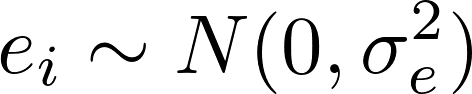
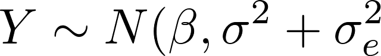
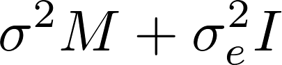

#  Geostatistical approach

Filed under: [Spatial Models][19]

This is what most people think of when you say "spatial statistics". You explicitly model the correlation matrix/function. Observations do not need to be on a grid; their correlation is typically determined by distance. This example takes you from simple examples with Gaussian observation noise to non-Gaussian response (GLMMs).

## Model description

The key model component is a latent Gaussian random field u(x,y), where x and y are the spatial coordinates. We assume that the field is isotropic, i.e. that

, where 

 

is the Euclidean distance.

### Gaussian measurement error  

The random field is typically observed with measurement error (e). The observations (Y) are:

where β is the expectation value. Marginally (at each point) u(x,y) ~ N(0,1), but note that we scale the field by a standard deviation σ. Further, we assume that , where σe is often called the "nugget" effect, so that in total )

 

### Specification of the covariance matrix  

The correlation matrix is denoted by _M_, and is defined elementwise as Mij = ρ(dij), where _dij_ is the distance between observation i and j. In this example we use an exponential correlation function ρ(_d_) = exp(-_a*d_), where a is a parameter (to be estimated) that controls how quickly the correlation drops off.

 

There is a special setup in ADMB that makes computations in geostatistical models efficient

>PARAMETER_SECTION
>>random_effects_vector u(1,n,2)
>>normal_prior M(u);
>
>NORMAL_PRIOR_FUNCTION void get_M(const dvariable& _a)
>>// Function descript goes here ....
>
>FUNCTION void evaluate_M(void)
>>get_M(a);

In the beginning it is easiest if you use this templates, but the advanced user may change the names according to the following rules:

* The "normal_prior" associates _M_ with the vector _u_ of random effects
    * You are free to name the correlation matrix anything you want; we use _M_
    * The only use of _M_ you should make is to assign a value to it inside NORMAL_PRIOR_FUNCTION (see examples).  
* NORMAL_PRIOR_FUNCTION
    * Purpose:   
        * Evaluate _M_
        * Add contribution from u to objective function : -0.5*logdet(_M_) -0.5*_u_*inv(_M_)*_u_  
    * Define exactly 1 function of this type; called "get_M" in our case, but you can change the name
    * get_M() should end with an assignment to _M_
    * get_M() can take more than more parameter, yielding more flexible correlation functions  
* evaluate_M()
    * There must **always** be a function with this name, i.e. you can not change its name even if you change the name of _M_
    * It should contain a call to get_M (or whatever you have called it).

### Phases
Each parameter to be estimated has an associated "phase" in ADMB. In latent variable models you should first estimate fixed effects (β) and measurement error (σ). In the second phase you estimate parameters associated with the latent random field (σe and a). In the first phase σe and a will be fixed to their initial values (whatever you set that to be).

## Exercises: Modify the model  
The code for the above model is given in "spatial_simple.tpl". You should try the following:

* **Plot variograms** of Y. You can use the R library "geoR" (if you have this package install in R) using the command  

>plot(variog(geodata=list(coords=Z,data=Y)))

    Run the ADMB program (so that "spatial_simple.rep" containing residuals gets

    produced) and then use the R commands

>r=scan("spatial_simple.rep")

>plot(variog(geodata=list(coords=Z,data=r)))

     The residuals r should be close to uncorrelated, while the correlation in Y should

     correspond to the correlation function (exponential) you have used to generate data.

* **Generating other datasets  **The R script "spatial_simple.R" generates the dat-file. Modify the script and run it using source("spatial_simple.R"), and see if the ADMB output changes accordingly. You also need to download "ADMButils.R").  
* **Implement non-RE version.** Because this is a fully Gaussian model it is possible to implement the likelihood directly without using the random effects features of ADMB. The key point is to notice that the (marginal) covariance matrix of Y is , where I is the identity matrix (1's on the diagonal; 0's everywhere else). Either write your own tpl, or use "spatial_nonre.tpl". Compare results and run times.  
* **Flexible correlation function** Use a half-normal correlation function , where -a1 and a2 are parameters that you estimate.

>tmpM(i,j)=a<sub1*exp(-square(d(i,j)/a2));

* **Experiment with phases **and see if the use of phases affects run times. Go back to "spatial_simple.tpl" and use the command "time" in your operating system to measure the run time.
    * Try to activate all parameters in phase 1
    * Try to activate "a" in phase 3

>time -est spatial_simple

* **Linear predictor **As in ordinary multiple regression we let X be a design matrix (that is constructed externally, using for instance "design.matrix()" in R)  

    * Let β be a vector; read in covariate (design) matrix X 
    * Insert linear predictor in expectation value  
    * Modify "spatial_simple.R" so that X is generated and written to the .dat file.

>DATA_SECTION
>>init_int p		// Number of fixed effects (b's)
>>init_matrix X(1,n,1,p)// Covariate matrix
>
>SEPARABLE_FUNCTION void normal_loglik()
>>dvariable mu = X(u)*beta + sigma*u_i;

* **Negative binomial response **Go back to "spatial_simple.tpl" and replace the Gaussian response with a negative binomial distribution. We now longer have an additive measurement error, but instead a GLMM, where it is natural to write the model in an hierarchical form

     where Y|u denotes conditional probability (conditionally on u).

* The expectation μ must be positive, so we use a log-link, i.e.  
* τ = Var(Y)/E(Y) > 1 is the over dispersion.   

    * For τ=1 the negative binomial distribution collapses to the Poisson distribution and τ=10 is a large deviation from Poisson (try to plot the probability function for τ=10).
    * τ should be given phase 2, while parameters governing the latent field (σ and a) should be postponed to phase 3  

>PARAMETER_SECTION
>>init_bounded_number tau(1.0,10,2)            // Over dispersion

>SEPARABLE_FUNCTION void negbin_loglik(...,const dvariable& tau)
>>dvariable sigma = exp(log_sigma);
>>dvariable mu = exp(beta + sigma*u_i);     // Mean of Y
>>l -= log_negbinomial_density(Y(i),mu,tau);

* **Code** ADMB (spatial_negbin.tpl) and R code for (spatial_negbin.R) are provided.  

###Files
* [spatial_negbin.R][1]
* [spatial_negbin.tpl][2]
* [spatial_nonre.tpl][3]
* [spatial_simple.R][4]
* [spatial_simple.dat][5]
* [spatial_simple.tpl][6]

[1]: ./spatial_negbin.R
[2]: ./spatial_negbin.tpl
[3]: ./spatial_nonre.tpl
[4]: ./spatial_simple.R
[5]: ./spatial_simple.dat
[6]: ./spatial_simple.tpl
[19]: ./../
