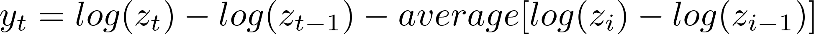
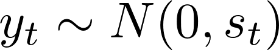
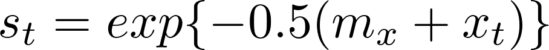

#  Stochastic volatility models for financial time series

Filed under:  [Finance][1]

Stochastic volatility models are used in mathematical finance to describe the evolution of asset returns, which typically exhibit changing variances over time.

### Model description
The dataset is  previously analyzed by [Harvey et al. (1994)][2], and later by several other authors. The data consist of a time series of daily poundollar exchange rates {_zt_} from the period 0181 to 285. The series of interest are the daily mean-corrected returns {_yt_}, given by the transformation

The stochastic volatility model allows the variance of _yt_ to vary smoothly with time. This is achieved by assuming that 
, 

where 

. 

Here, the smoothly varying component _xt_ is assumed to be an autoregression.

### Details
* [sdv.pdf][3]

### Files
* [sdv.tpl][4]:  Model file
* [sdv.dat][5]: Data file
* [sdv.pin][6]: Starting values for the numerical optimizer  
* [sdv.par][7]: Result file (what you get when you compile and run your model)  

[1]: https://github.com/admb-project/examples/search?utf8=%E2%9C%93&q=Finance
[2]: citations.html#harv:ruiz:shep:1994
[3]: sdv.pdf
[4]: sdv.tpl
[5]: sdv.dat
[6]: sdv.pin
[7]: sdv.par
